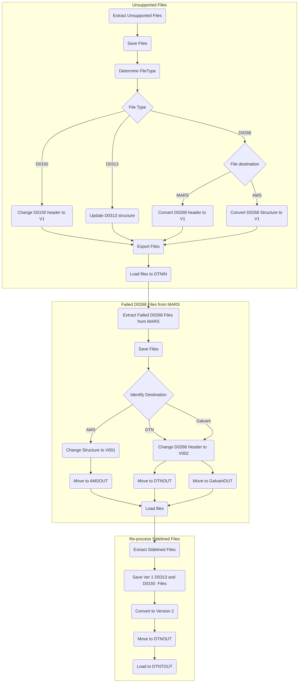

# Mermaid Graphs
## Creating graphs from code

 [Mermaid ](https://mermaid-js.github.io/mermaid/#/) is a Javascript  package that enables the rendering of graphs from text based descriptions. The [web page](https://mermaid-js.github.io/mermaid/#/README) contains a number of really good examples of how to create various diagram types.  The section on [flowcharts](https://mermaid-js.github.io/mermaid/#/flowchart) is particularly good. 

Here is an example of a Mermaid graph created using mark down

