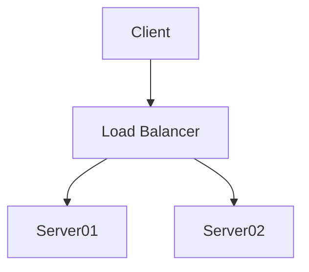

I have been off for a few days and used that time to explore a few new tools and ideas. I thought I'd share as they might be of interest to others. Of course, I am sure many of you  of you will be familiar with these types of tools.

For some reason I started looking at [Markdown](https://en.wikipedia.org/wiki/Markdown) editors,  I'd never really come across or used markdown before, but like the concept that basic file formatting can be used in a plain text file.  Perhaps it's because of an aversion to using a mouse but I find keys  much quicker to use. There are many excellent editors that provide distraction free writing environments including MS VS Code. 

Having played around with various markdown editors I came across 
[Obsidian](https://obsidian.md/) which is a new application that is loosely categorised as a PKM (Personal Knowledge Management) tool which is designed around the use markdown files. These files can link to external documents and also to other markdown documents held locally.  Worth a look if you can avoid going down the rabbit hole of approaches to research and associated workflow models. 

I am very keen on the idea of using visual modelling tools when designing / reviewing processes. However, there is always (it seems to me) an issue with maintaining these diagrams - *"Documentation-Rot"* and keeping track of changes. I have found a couple of "tools" that provide markdown like support for creating diagrams from text files. The first of these is [Mermaid](https://mermaid-js.github.io/mermaid/#/./n00b-overview) which lets you easily create UML and other types of diagrams such as GANTT charts. The other tool that has been around for a bit longer is [PlantUML.](https://plantuml.com/) this provides similar functionality and graph types.

As an example an Mermaid graph, is described as

```code
graph TD
    A[Client] --> B[Load Balancer]
    B --> C[Server01]
    B --> D[Server02]
```

This is rendered asI have been off for a few days and used that time to explore a few new tools and ideas. I thought I'd share as they might be of interest to others. Of course, I am sure many of you  of you will be familiar with these types of tools.

For some reason I started looking at [Markdown](https://en.wikipedia.org/wiki/Markdown) editors,  I'd never really come across or used markdown before, but like the concept that basic file formatting can be used in a plain text file.  Perhaps it's because of an aversion to using a mouse but I find keys  much quicker to use. There are many excellent editors that provide distraction free writing environments including MS VS Code. 

Having played around with various markdown editors I came across 
[Obsidian](https://obsidian.md/) which is a new application that is loosely categorised as a PKM (Personal Knowledge Management) tool which is designed around the use markdown files. These files can link to external documents and also to other markdown documents held locally.  Worth a look if you can avoid going down the rabbit hole of approaches to research and associated workflow models. 

I am very keen on the idea of using visual modelling tools when designing / reviewing processes. However, there is always (it seems to me) an issue with maintaining these diagrams - *"Documentation-Rot"* and keeping track of changes. I have found a couple of "tools" that provide markdown like support for creating diagrams from text files. The first of these is [Mermaid](https://mermaid-js.github.io/mermaid/#/./n00b-overview) which lets you easily create UML and other types of diagrams such as GANTT charts. The other tool that has been around for a bit longer is [PlantUML.](https://plantuml.com/) this provides similar functionality and graph types.

As an example an Mermaid graph, is described as

```code
graph TD
    A[Client] --> B[Load Balancer]
    B --> C[Server01]
    B --> D[Server02]
```

This is rendered as



Support for these tools varies across editors with some supporting Mermaid, PlantUML or others both. MS VS Code for example has extensions that  support  both, these extensions provide syntax highlighting, "code" completion, diagram preview and different generation options.  

Looking at the various diagrams that these tools support I stumbled upon [The C4 model for visualising software architecture](https://c4model.com/) which I think provides a nice way of modelling architecture, from a system context, container, component and code level. Again MS Code has extensions that support this modelling which can be used to generate PlantUML diagrams from the text description of the model. 


Support for these tools varies across editors with some supporting Mermaid, PlantUML or others both. MS VS Code for example has extensions that  support  both, these extensions provide syntax highlighting, "code" completion, diagram preview and different generation options.  

Looking at the various diagrams that these tools support I stumbled upon [The C4 model for visualising software architecture](https://c4model.com/) which I think provides a nice way of modelling architecture, from a system context, container, component and code level. Again MS Code has extensions that support this modelling which can be used to generate PlantUML diagrams from the text description of the model. 